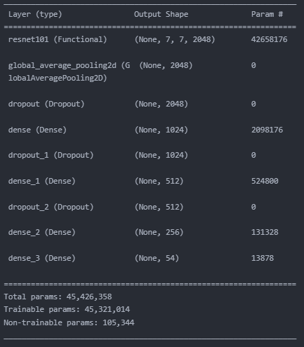

# 제주도 랜드마크 이미지 예측 모델
### content
1. [ResNet101을 이용한 모델 학습](#1-resnet101을-이용한-모델-학습)
2. [Flask를 이용한 랜드마크 이미지 예측 API](#2-flask를-이용한-랜드마크-이미지-예측-api)

---
<br>

## 1. ResNet101을 이용한 모델 학습

* 데이터셋

    * 학습 대상(랜드마크) 이미지 선정
        * 국내 랜드마크 이미지([AIHub-랜드마크 이미지](https://aihub.or.kr/aidata/8009))
        * 랜드마크 선정 기준 : 비짓제주([visitjeju.net](https://www.visitjeju.net/kr)) 여행지 목록 중, 좋아요순•리뷰순 기준으로 정렬 후 선정
        * 랜드마크 수 : 54개 (약 10,000장)
        * 랜드마크 목록 :  [categoryList.csv](./back/public/categoryList.csv)
        * 인기 랜드마크지만 AIHub 데이터셋에 없는 랜드마크 일부는 크롤링 진행
        * 데이터셋의 불균형을 해결하기 위해 일부 크롤링 진행

        <br>
    * 데이터셋 폴더 구조
        ```
        ./dataSet/
            └── images
                ├── 감귤박물관
                │   ├── 제주감귤 박물관_038_38969881.jpg
                │   ├── 제주감귤 박물관_039_38969882.jpg
                │   ├── ...
                │
                ├── 검멀레동굴
                │   ├── 검멀레동굴 _066_42469394.jpg
                │   ├── 검멀레동굴 _067_42469395.jpg
                │   ├── ...
                │
                ├── ...
            
        ```
<br>

* 제주도 랜드마크 이미지 학습
    * 학습을 위한 stack
        - Python
        - Tensorflow
        - Keras
        - ResNet101 (convolutional neural network)
        - Pandas
        - Numpy

    <br>

    * Train/Test/Validation split   
        * ```splitfolders```라이브러리를 이용해 ```8:1:1``` 비율로 split   
        * split 코드 - [trainTestSplitImage.py](./utils/trainTestSplitImage.py)   
    <br>

    * Data Augmentation
        * 데이터 특성상 유사도가 높은 이미지들이 많아 ```Tensorflow```의 ```ImageDataGenerator```를 이용해 test 이미지를 제외한 나머지 이미지들을 증강
        * ImageDataGenerator config
            ```python
            ImageDataGenerator(rescale=1./255,
                                  width_shift_range=0.1,
                                  height_shift_range=0.1,
                                  shear_range=0.2,
                                  zoom_range=-0.3,
                                  horizontal_flip=False,
                                  vertical_flip=False,
                                  brightness_range=[0.7, 1.3],
                                  fill_mode='nearest'
                                  )
            ```
    <br>

    * ResNet101 + custum layer   
        다양한 모델 테스트 과정과 [ILSVRC](https://www.image-net.org/challenges/LSVRC/), [DACORN-랜드마크 분류 AI 경진대회](https://dacon.io/competitions/official/235585/overview/description)의 우승 경력을 고려하여 ResNet101 모델을 제주도 랜드마크 이미지 분류 학습을 위한 모델로 선정
        * ResNet   
            ResNet은 기본적으로 VGG-19의 구조를 뼈대로 함. 컨볼루션 층들을 추가해 깊게 만든 후, shortcut들을 추가한 구조   
                
            아래 표는 18층, 34층, 50층, 101층, 152층의 ResNet의 구조 요약   
               
            ResNet은 [ILSVRC](https://www.image-net.org/challenges/LSVRC/)(ImageNet Large Scale Visual Recognition Challenge) 2015에서 우승한 모델로 이미지 분류 인식 오류율 3.8%로 1등을 차지한 모델   
               
            논문 : [Deep Residual Learning for Image Recognition](https://arxiv.org/abs/1512.03385)

        <br>

        * 우리 모델 구조   
            ResNet101의 FC-layer를 제외한 feature extraction부분의 레이어만 사용, sequential 구조를 사용해 새로운 분류기를 작성하였고 ResNet101의 뒷단에 연결 후 학습 진행   
               
        
        * 학습 코드   
            [ResNet101Train.ipynb](./model/ResNet101Train.ipynb)
        
<br>

---

<br>

## 2. Flask를 이용한 랜드마크 이미지 예측 API
* 학습된 weight 다운로드 
    1. 저장 위치   
        ```
        $ cd back/public/model
        ```   
    <br>

    2. 다운로드 방법   
        - Windows   

        ```sh
        Google Drive Link - https://drive.google.com/file/d/1d_grGrFqUfF6AFpfu-JHFuPo6FK9rZHT/view?usp=sharing
        ```   

        - Linux   

        ```sh
        $ wget --load-cookies /tmp/cookies.txt "https://docs.google.com/uc?export=download&confirm=$(wget --quiet --save-cookies /tmp/cookies.txt --keep-session-cookies --no-check-certificate 'https://docs.google.com/uc?export=download&id=1d_grGrFqUfF6AFpfu-JHFuPo6FK9rZHT' -O- | sed -rn 's/.*confirm=([0-9A-Za-z_]+).*/\1\n/p')&id=1d_grGrFqUfF6AFpfu-JHFuPo6FK9rZHT" -O model.h5 && rm -rf /tmp/cookies.txt
        ```
        <br>

* local 환경 서버 테스트   

  0. back 폴더로 진입
      ```sh
      $ cd back
      ```

  1. 가상환경 생성
      ```sh
      $ python -m venv .flask
      ```
  2. 가상환경 실행
      - Windows
        ```sh
        $ source .flask/Scripts/activate
        ```
      - Linux
        ```sh
        $ source .flask/bin/activate
        ```
  3. 필요 패키지 설치
      ```sh
      (.flask) $ pip install -r requirements.txt
      ```
  4. flask 서버 실행
      ```sh
      (.flask) $ cd src
      (.flask) $ python app.py
      ```
      <br>

* WSGI서버 연결 실행 - Gunicorn (Linux 환경에서만 가능)
  1. Gunicorn 설치
      ```sh
      (.flask) $ pip gunicorn
      ```
  2. Gunicorn으로 app.py 실행
      ```sh
      (.flask) $ cd src
      (.flask) $ gunicorn --workers {workers} --timeout {sec} --bind 0.0.0.0:{port} wsgi:application
      ```
